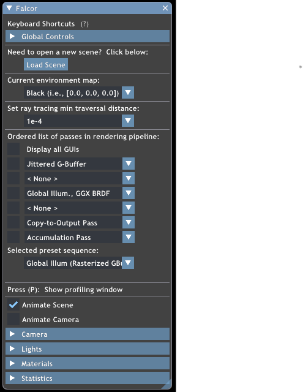
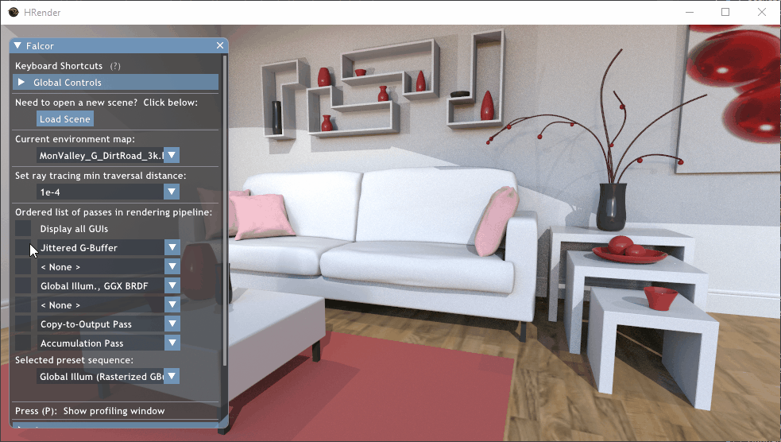

# Getting Started

## Solution and Project Layout

### Falcor
Core framework features and code are contained within the `Falcor` project in the solution. This is a DLL project and is not executable on its own. 

### hrender
The main implementation code is in the `hrender` project in the solution. 

### Projects/Folders To Be Removed
- Mogwai
  - `Mogwai` is a `Falcor` application used to render Falcor render graphs. It is the recommended workflow when using `Falcor 4.1` for prototyping/implementing rendering techniques.  
  Our implementation does not make use of this, and instead is a standalone Falcor application. `Mogwai` is left in the repository for convenient reference, and should be removed in the final implementation.
- Samples
  - Projects in the `Samples` folder (`HelloDXR`, `ModelViewer`, and `ShaderToy`) are applications using Falcor directly that demonstrate how to use some of the fundamental features and abstractions Falcor provides.
- RenderPasses
  - The `RenderPasses` folder contains a number of components ("Render Passes") that can be assembled to create render graphs. These components are required for some of the included sample render graphs, but will not build unless you select them manually (Right-Click -> `Build`), or use `Build Solution`. Render graphs can be used with `Mogwai` to render scene files.  
  Our implementation does not make use of this, but these are left in the repository for convenient reference, and should be removed in the final implementation.

-----------------------

## Application Usage
After building the project, run the project. The default scene, pink room, will be loaded, along with the default preset rendering pass sequence. The options available are as follows:  

Note that some options are hidden if they are irrelevant, e.g. "Current environment map" will not appear if none of the passes use an environment map, and "Animate Scene/Camera" will not appear unless the scene file opened has animations.

The passes that appear in the "Ordered list of passes in rendering pipeline" are those that are set in [`hrender.cpp`](/Source/Samples/hrender/hrender.cpp), using `setPass()` or `setPassOptions()`. For details on how to use the `RenderingPipeline` class and writing your own `RenderPass`es, refer to the [DXR Tutorials](http://cwyman.org/code/dxrTutors/dxr_tutors.md.html) by Chris Wyman.

Checking the boxes in the list of passes allows you to toggle the visibility of the pass's options GUI. To open/close all windows at once, or to realign the GUI option windows, simply check/uncheck the "Display all GUIs" option:

Under "Selected preset sequence", you can select a preset sequence to quickly change between rendering pipelines.  

In the default list of presets that the project has, we have:
- Global Illum (Rasterized GBuffer)
  - Makes use of a rasterized GBuffer (toggle-able environment map and camera jitter), with a GGX shading pass that computes direct/indirect lighting, and temporally accumulates frames.
  - The shading pass uses the GBuffer, and has three lighting contributions per pixel:
      - Material emissive color value
      - Direct illumination from a single light - the lights in the scene are randomly sampled, and the light's contribution is added if the light source is not occluded
      - Indirect (global) illumination - a single ray is shot, either a diffuse ray or a specular GGX ray. This is a recursive ray.
- Global Illum (Raytraced GBuffer)
  - Same as above, but using a GBuffer that is produced using ray casting instead. This creates cleaner scenes where texture filtering causes a lot of distortion.
- Global Illum (Demodulated Raster GBuffer)
  - Similar to the first option, but the GBuffer is a bit more inflated. For denoising of the raytraced output, we need several other properties (color moments, normal moments, motion vectors etc.) to be passed down to the denoising pass, and the shading pass does not output a single color, rather it outputs four properties - direct albedo, direct illumination, indirect albedo, and indirect illumination. Other than the inflated pipeline, this preset has the same output as the first preset, but requires an additional pass to modulate the four outputs into a single color.
- Global Illum Denoised (Demodulated Raster GBuffer)
  - This is similar to the third option, but adds a denoising pass. The denoising pass is from NVIDIA's [Spatiotemporal Variance-Guided Filtering](https://research.nvidia.com/publication/2017-07_Spatiotemporal-Variance-Guided-Filtering%3A) sample code (with minor modifications). 
    - The high level idea is that it performs a gaussian filter on neighbouring pixels, while also taking into account historical frame data. 
    - For the best image quality, keep the values for edge stopping properties as low as possible while not producing artifacts.
- Rasterized GBuffer Output
  - This preset can be used to preview the GBuffer output, which has multiple values packed into the texture, and requires a decoding pass.
- Ambient Occlusion
  - This pass is simply an ambient occlusion pass.

For details on how to create preset sequences, refer to [Preset Sequences](./Preset_Sequences.md).
