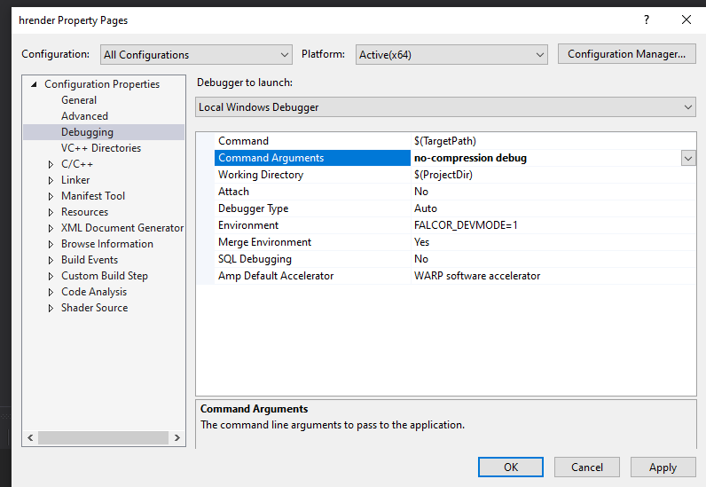

# Hardware Ray-Tracing Assisted Hybrid Rendering Pipeline for Games
This project implements a distributed and a hybrid rendering pipeline. The server performs ray tracing to produce visibility data, and this data is sent to the client to produce the final image with rasterisation (deferred shading). The idea is to render higher-quality images on a thin client that cannot support hardware-accelerated ray tracing, while not compromising on interactive frame rates needed for video gaming.

For now, our implementation has a direct-lighting shading algorithm that makes use of distributed rendering and ray tracing. For more details about the rendering part of the pipeline, you may refer to section 3 of [Louiz's FYP report](Final_Report.pdf).

As for the networking part of the pipeline, we have a client-server architecture that communicates with UDP, and we perform prediction of the received data on the client to make up for network latency. You may refer to section 3 of [Alden's FYP report](FYP_Final_Report_Alden_v2.pdf) for more details.

Currently, our implementation supports static scenes that allows user input to move the camera, but it does not support moving objects. The visual quality needs improvement, requiring the addition of more visual effects before it is ready for production.  The pipeline runs at a frame rate of more than 100 fps with LZ4 compression. However, there is potential to achieve greater compression by encoding the differences between subsequent frames (i.e. temporal compression), as the data tends to be quite similar. One possible method is with H.264/AVC video compression which makes use of I-frames and P-frames. Refer to section 5.2 and 5.3 of [Alden's FYP report](FYP_Final_Report_Alden_v2.pdf) for a dicussion about the areas of improvement and possible future work.

You may look at [Chris Wyman's DXR tutorial](http://cwyman.org/code/dxrTutors/dxr_tutors.md.html) to get an understanding of the basic structure and the classes of the code base, because multiple abstractions of Falcor that we have used in the pipeline were originally derived from the tutorial. The [Developer Guide](docs/DeveloperGuide.md) gives a more in-depth walkthrough of the pipeline. Lastly, for a thorough explanation of the implementation details, you may refer to the FYP reports.

## Important Files/Folders
- [Falcor](Falcor) 
  - Stores the Falcor 4.4 files from [NVIDIA's github page](https://github.com/NVIDIAGameWorks/Falcor), with modifications. 
  - Before modifying this with the latest version of Falcor, please check the [Developer Guide](docs/DeveloperGuide.md) on changes that need to be made to maintain compatibility.
  - The project is accessed through the Falcor.sln file in this directory.
- [hrender](hrender)
  - Stores our custom passes, as well as framework and passes from the [DXR tutorials](http://cwyman.org/code/dxrTutors/dxr_tutors.md.html) which have been modified for our purposes.
- [Louiz's FYP report](Final_Report.pdf) and [FYP presentation slides](Final_Presentation_Slides_and_Script.pptx)
  - Explains the first iteration of the rendering pipeline. Note that the networking part of the pipeline is different in the current version, however the parts of the pipeline that deal with graphics rendering are mostly unchanged.
- [Alden's FYP report](FYP_Final_Report_Alden_v2.pdf)
  - Explains the second iteration of the rendering pipeline, with network improvements to use UDP, increased frame rates, and prediction of received data at the client.
- [Nicholas's FYP report](FYP_Final_Report_Nicholas.pdf)
- [Developer Guide](docs/DeveloperGuide.md)
  - Talks about the codebase modifications in more detail.
- [Future Work Recommendations](Future_Work_Recommendations.md)
  - Talks about features that are recommended for development.

## Prerequisites
For Falcor (Taken from [Falcor/README.md](Falcor/README.md))
- Windows 10 version 2004 (May 2020 Update) or newer
- Visual Studio 2019
- [Windows 10 SDK (10.0.19041.0) for Windows 10, version 2004](https://developer.microsoft.com/en-us/windows/downloads/windows-10-sdk/)
- A GPU which supports DirectX Raytracing, such as the NVIDIA Titan V or GeForce RTX (make sure you have the latest driver)

Other prerequisites
- Cuda Toolkit 11.6
- NVIDIA Video Codec SDK
- Scene Data

Optional:
- Windows 10 Graphics Tools. To run DirectX 12 applications with the debug layer enabled, you must install this. There are two ways to install it:
    - Click the Windows button and type `Optional Features`, in the window that opens click `Add a feature` and select `Graphics Tools`.
    - Download an offline package from [here](https://docs.microsoft.com/en-us/windows-hardware/test/hlk/windows-hardware-lab-kit#supplemental-content-for-graphics-media-and-mean-time-between-failures-mtbf-tests). Choose a ZIP file that matches the OS version you are using (not the SDK version used for building Falcor). The ZIP includes a document which explains how to install the graphics tools.
- NVAPI (see below)

## NVAPI installation
This step is optional (as NVAPI is optional). If not enabled, set `_ENABLE_NVAPI` to `false` in `Source/Falcor/Core/FalcorConfig.h`
After cloning the repository, head over to https://developer.nvidia.com/nvapi and download the latest version of NVAPI (this build is tested against version R440).
Extract the content of the zip file into `Source/Externals/.packman/` and rename `R440-developer` to `nvapi`.

Finally, set `_ENABLE_NVAPI` to `true` in `Source/Falcor/Core/FalcorConfig.h`

## CUDA Toolkit
Get cuda toolkit here: https://developer.nvidia.com/cuda-toolkit

Project is currently using version 11.6, so make sure to get that version.

Note: some errors may occur if path is not set correctly on visual studio 

## NVIDIA Video SDK Installation
- Download  NVIDIA VIDEO SDK  (https://developer.nvidia.com/nvidia-video-codec-sdk)
- Rename to  ‘Video_Codec_SDK_11010’  and place in same folder as hrender

- Follow Instructions in Read_Me.pdf  to build Samples (above step must be done before building)

Initially, projects AppEncD3D12 and AppDec in Falcor Solution should be unavailable.
- After building, reload these two projects with dependencies
- Set both projects to build as static library under Project Properties

- Ensure that hrender references those two projects

Note: Directory of video codec sdk should look something like this

- Lastly, when building Falcor solution, if you run into a compile error saying that ComPtr is ambiguous in NvEncoder.cpp (or other file), fix by changing all ComPtr in NvEncoder.cpp to Microsoft::WRL::ComPtr. There should be about 4 of these occurrences.

## Scene Data
Ensure you have all scene data in Falcor\Bin\x64\Debug or Falcor\Bin\x64\Release, depending on build configuration. These files are large and so not on github. Can copy from lab machines or get from another project member.

Without scene data, there will be an error "cant find krujka.me". Particularly this may occur when switching build configurations (DebugD3D12, ReleaseD3D12)

## Usage
Clone the repository or download it as a zip file. The solution file that contains the project is in the `./Falcor` folder, `./Falcor/Falcor.sln`. 

After opening the solution, in the solution explorer, right click and set `hrender` as the startup project.

Set the debug mode to either DebugD3D12 or ReleaseD3D12.

Right click the solution name in the solution explorer and build the solution.

### Running on a single machine
To run it on a single machine for debugging, go to the project properties, and under Debugging > Command Arguments, ensure that no arguments are provided.

Then simply run the program.

### Running the distributed algorithm on two machines
To run the distributed pipeline, have the program set up on two separate machines. On one machine, the command arguments should be `server`, and the other should be `client`. If no arguments are specified, the entire pipeline will run on a single machine.

On the client PC, `hrender.cpp` must specify the server's IP address under the line
`ResourceManager::mNetworkManager->SetUpClientUdp("172.26.186.144", DEFAULT_PORT_UDP);`
You may change the value of `DEFAULT_PORT_UDP` (you must set it in **both** `NetworkPasses/ServerNetworkManager.h` and `NetworkPasses/ClientNetworkManager.h`) for the program to communicate on a different port. 

The server's IP address can be acquired using command prompt and `ipconfig`.

The server should start running first before the client. Once the server has
initialised successfully, a debug message will be shown in the server, showing
that it is waiting for the client:
`= Pre-Falcor Init - Trying to listen for client width/height... =========`

An example of what the server and client will see is available on the [demonstration video](Demonstration_Video.mkv).

Currently, we do not have a way to dynamically load a new scene, so to use a different scene, change `sceneIndex` in the struct `RenderConfiguration renderConfiguration` that is found in `hrender.cpp`.

### Frequently encountered errors
- The server fails to start with `Pre-Falcor Init - Bind failed with error code: 10048`.
  - Change the value of `DEFAULT_PORT_UDP` in **both** `NetworkPasses/ServerNetworkManager.h` and `NetworkPasses/ClientNetworkManager.h`. The default is 1505, but you may try values like 1504 or 1506. Make sure that your firewall allows UDP communication across the specified port numbers. 
 - When setting up NVIDIA Video SDK in build folder in Samples (ie. Samples/build). If you run into an error saying “cant find CMakeLists.txt”, it means you either 1) got the directory set up wrong, or 2) you moved the directories after building (cant do that)

