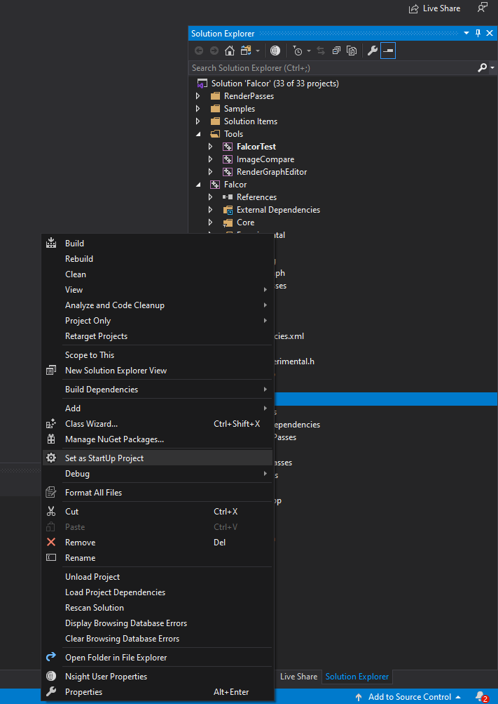
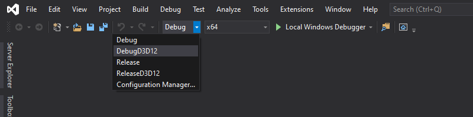
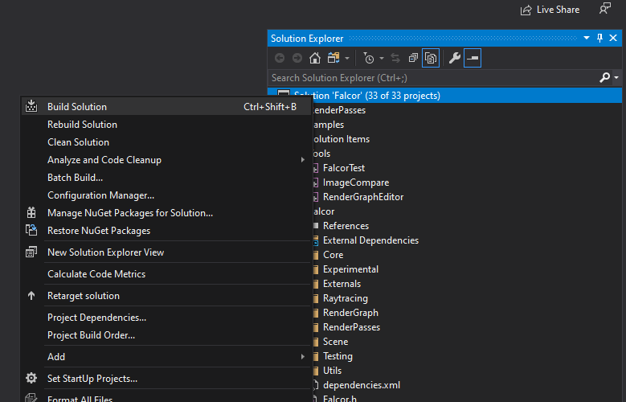
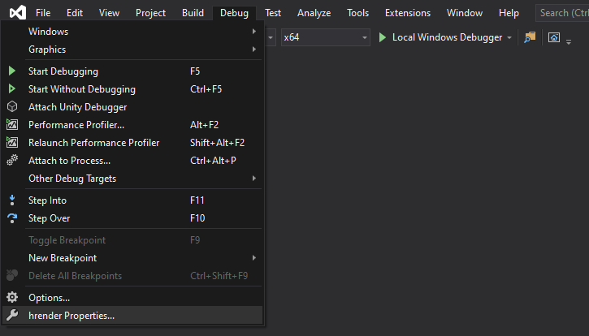

# Distributed Hybrid Rendering (DHR)

This project implements a hybrid rendering pipeline in a distributed rendering approach. The server performs ray tracing to produce visibility data, and this data is sent to the client to produce the final image with rasterization (deferred shading). The idea is to render higher-quality images on a thin client that cannot support hardware-accelerated ray tracing, while not compromising on interactive frame rates.

For now, our implementation has a direct-lighting shading algorithm that makes use of distributed rendering and ray tracing. For more details about the rendering part of the pipeline, you may refer to section 3 of [Louiz's FYP report](docs/FYP_Final_Report_Louiz.pdf).

As for the networking part of the pipeline, we have a client-server architecture that communicates with UDP, and we perform prediction of the received data on the client to make up for network latency. You may refer to section 3 of [Alden's FYP report](docs/FYP_Final_Report_Alden_v2.pdf) for more details.

Currently, our implementation supports static scenes that allow user input to move the camera as well as predefined camera animation sequences, but it does not handle moving objects. The visual quality needs improvement, requiring the addition of more visual effects before it is ready for production.  The pipeline runs at a frame rate of more than 100 fps with LZ4 compression. However, there is potential to achieve greater compression by encoding the differences between neighbouring frames (i.e. temporal compression), as the data tends to be quite similar. One possible method is with H.264/AVC video compression which makes use of I-frames and P-frames.

You may look at [Chris Wyman's DXR tutorial](http://cwyman.org/code/dxrTutors/dxr_tutors.md.html) to get an understanding of the basic structure and the classes of the code base because multiple abstractions of Falcor that we have used in the pipeline were originally derived from the tutorial. The [Developer Guide](docs/DeveloperGuide.md) gives a more in-depth walkthrough of the pipeline. Lastly, for a thorough explanation of the implementation details, you may refer to the FYP reports.

## Important Files/Folders

- [Falcor](Falcor) 
    - Stores the Falcor 4.4 files from [NVIDIA Falcor's GitHub page](https://github.com/NVIDIAGameWorks/Falcor), with modifications. 
    - Before modifying this with the latest version of Falcor, please check the [Developer Guide](docs/DeveloperGuide.md) for changes that need to be made to maintain compatibility.
    - The project is accessed through the `Falcor.sln` file in this directory.
- [hrender](hrender)
    - Stores the custom passes, as well as framework and passes from the [DXR tutorial](http://cwyman.org/code/dxrTutors/dxr_tutors.md.html) which have been modified for our purposes.
- [Louiz's FYP report](docs/FYP_Final_Report_Louiz.pdf) and [FYP presentation slides and script](docs/FYP_Final_Presentation_Slides_and_Script_Louiz.pptx)
    - Explains the first iteration of the rendering pipeline. Note that the networking part of the pipeline is different from the current version but the graphics rendering passes are mostly unchanged.
- [Alden's FYP report](docs/FYP_Final_Report_Alden_v2.pdf) and [Nicholas's FYP report](docs/FYP_Final_Report_Nicholas.pdf)
    - Explain the second iteration of the rendering pipeline, with network improvements to use UDP, frame rate optimizations, enhanced sequence of passes and prediction of received data at the client.
- [Developer Guide](docs/DeveloperGuide.md)
    - Talks about the codebase modifications from `Falcor` and the [DXR tutorial](http://cwyman.org/code/dxrTutors/dxr_tutors.md.html) in more detail.
- [Future Work Recommendations](docs/Future_Work_Recommendations.md)
    - Talks about features that are recommended for development.

## Prerequisites

### For [Falcor](Falcor/README.md)
- Windows 10 version 2004 (May 2020 Update) or newer
- Visual Studio 2019
- [Windows 10 SDK (10.0.19041.0) for Windows 10, version 2004](https://developer.microsoft.com/en-us/windows/downloads/windows-10-sdk/)
- A GPU which supports DirectX Raytracing, such as the NVIDIA Titan V or GeForce RTX (make sure you have the latest driver)

### CUDA Toolkit 11.6

Get the CUDA Toolkit here: https://developer.nvidia.com/cuda-toolkit. The project is currently using `version 11.6`, so make sure to get that version.

Note: some errors may occur if the path is not set correctly for Visual Studio

### Scene Data

Download the scenes [here](https://drive.google.com/file/d/10kqUg_3rV2HZCc70UNt88UfnoMPAJEYu/view?usp=sharing). These files are large and so they are not on GitHub. Extract the zip file into the `hrender` folder. The scene files should appear under `hrender/Data`.

### Optional

- Windows 10 Graphics Tools. To run DirectX 12 applications with the debug layer enabled, you must install this. There are two ways to install it:
    - Click the Windows button and type `Optional Features`, in the window that opens click `Add a feature` and select `Graphics Tools`.
    - Download an offline package from [here](https://docs.microsoft.com/en-us/windows-hardware/test/hlk/windows-hardware-lab-kit#supplemental-content-for-graphics-media-and-mean-time-between-failures-mtbf-tests). Choose a ZIP file that matches the OS version you are using (not the SDK version used for building Falcor). The ZIP includes a document which explains how to install the graphics tools.
- NVAPI:
    - To disable it, set `_ENABLE_NVAPI` to `0` in `Falcor/Source/Falcor/Core/FalcorConfig.h`
    - To enable it, head over to https://developer.nvidia.com/nvapi and download the latest version of NVAPI (this build is tested against version R440). 
        - Extract the content of the zip file into `Falcor/Source/Externals/.packman/` and rename `R[X]-developer` to `nvapi`. 
        - Finally, set `_ENABLE_NVAPI` to `1` in `Falcor/Source/Falcor/Core/FalcorConfig.h`

## Building the Solution

Clone the repository or download it as a zip file. The solution file that contains the project is in the `Falcor` folder (i.e. `Falcor/Falcor.sln`). 

After opening the solution, in the Solution Explorer, right-click and set `hrender` as the startup project.

Set the Solution Configuration to either `DebugD3D12` or `ReleaseD3D12`.

Right-click the solution name in Solution Explorer and build the solution.

## Running the Project

Go to `Project Properties`, and check under `Debugging > Command Arguments`.

- To run on a single machine for debugging, ensure that no arguments are provided and simply run the program.

- To run the distributed pipeline, have the program set up on two separate machines. On one machine, the command argument should be `server`, and the other should be `client`. 
    - On the client PC, `hrender.cpp` must specify the server's IP address within the line `ResourceManager::mNetworkManager->SetUpClientUdp("XXX.XXX.XXX.XXX", DEFAULT_PORT_UDP);`. You may change the value of `DEFAULT_PORT_UDP` (you must set it in **both** `hrender/NetworkPasses/ServerNetworkManager.h` and `hrender/NetworkPasses/ClientNetworkManager.h`) for the program to communicate on a different port. 
    - The server's IP address can be acquired by typing `ipconfig` in the command prompt.
    - The server should start running first before the client. Once the server has initialized successfully, the following debug message will be shown on the server, showing that it is waiting for the client: `= Pre-Falcor Init - Trying to listen for client width/height... =========`
    - An example of what the server and client will see is available on the [demonstration video](docs/FYP_Demonstration_Video_Louiz.mkv).

- Currently, we do not have a way to dynamically load a new scene, so to use a different scene, change `sceneIndex` in the struct `RenderConfiguration renderConfiguration` that is found in `hrender.cpp`.

## Frequently Encountered Errors

- The server fails to start with error message `Pre-Falcor Init - Bind failed with error code: 10048`.

    - Change the value of `DEFAULT_PORT_UDP` in **both** `hrender/NetworkPasses/ServerNetworkManager.h` and `hrender/NetworkPasses/ClientNetworkManager.h`. The default is 1505 but you may try values from 1500 to 1510. Make sure that your firewall allows UDP communication across the specified port numbers. 