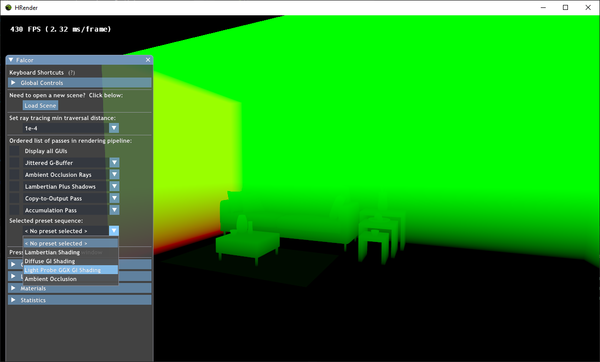
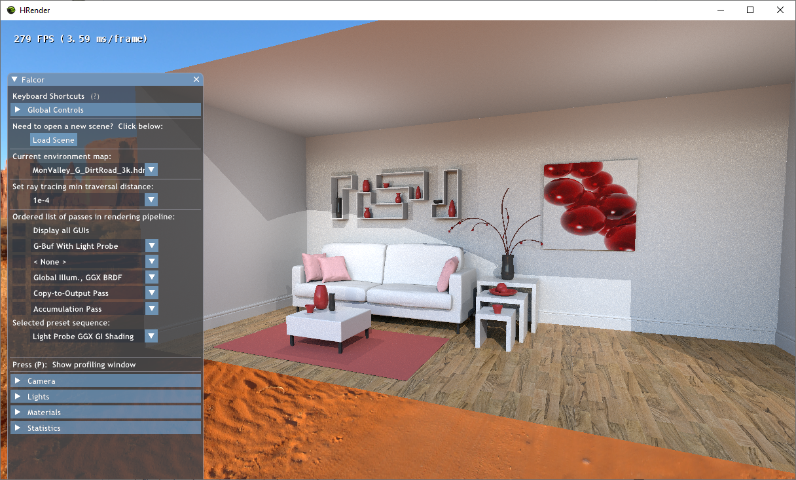
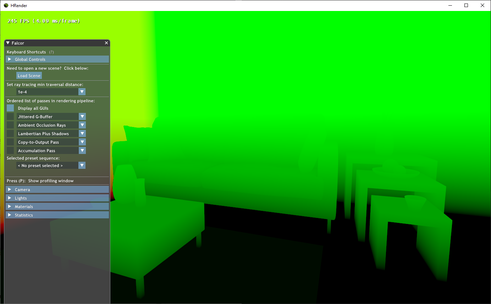
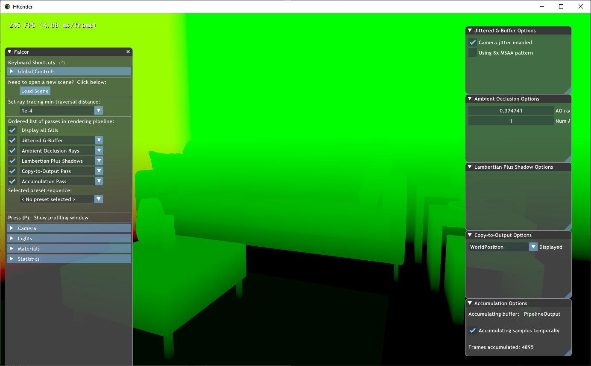
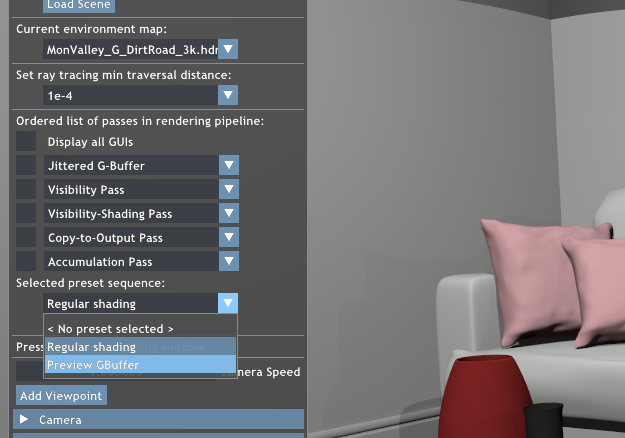
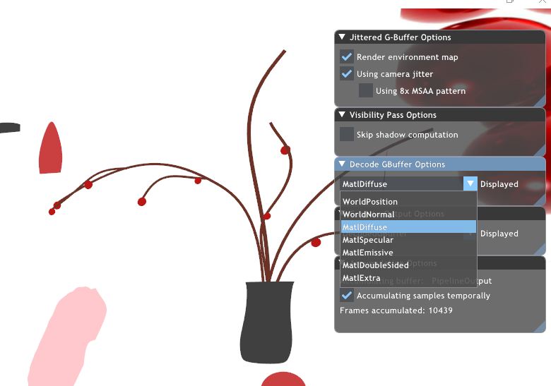

# Developer Guide
If you are reading this, it is assumed that you have read through the [README](../README.md) for installation/running the program, the [Final report](../Final_Report.pdf) to have a good understanding of the high level details of our pipeline, and [Chris Wyman's DXR tutorial](http://cwyman.org/code/dxrTutors/dxr_tutors.md.html) for a low level understanding of how the pipeline is structured, before coming here for more details on how to go on adding features to the current code base.

## Directory Structure
- Falcor - the Falcor 4.3 base code (with modifications mentioned below)
- hrender - The location where our source code is for the pipeline
  - Data - Our default scene and environment map
  - DxrTutorCommonPasses - RenderPasses available in the DXR Tutorial (edited for our purposes)
    - Data (similar for below) - Shaders for the Cpp/H
  - DxrTutorSharedUtils - The main code for the rendering pipeline, and the abstract classes for render passes and shader programs
    - We also added one more file here - the **NetworkManager** - this is used for our network communication
  - DxrTutorTestPasses - Test passes from the dxr tutorials
  - Libraries - Header only library for LZO compression 
  - NetworkPasses - Directory containing our actual distributed passes
    - This includes our MemoryTransferPasses, our NetworkPass, the VisibilityPass and Visibility Shading pass
  - RasterizedPasses - This contains a cascaded/omnidirectional mapped shadows implementation - for now this is not used, but can be used in future. Not included in the solution right now.
  - SVGFPasses - This contains code from [NVIDIA's page](https://research.nvidia.com/publication/2017-07_Spatiotemporal-Variance-Guided-Filtering%3A), ported to Falcor 4.3 and abstracted. It is slightly buggy with walls aligned with the XZ-plane. Not included in the solution right now.
  - TestPasses - More test passes for our use.
    - ModulateAlbedoIllum pass - this is used to debug the SVGF GBuffer and render passes. For example usage, please refer to the other [HRender repo](https://github.com/loveandbejoyful/hrender).
    - DecodeGBufferPass - This is used to preview the GBuffer's contents, because we compacted the GBuffer as mentioned in the report.

## Changes to the DXR Tutorial rendering pipeline
These are documented in the [CA report](../CA_Report.pdf), so please go through it for more details.

### Presets
The purpose of the creation of Presets to allow us to eyeball changes between different rendering pipelines. This is much more convenient than running two compiled versions of the program, or using screenshots, and should increase productivity.

If we have a pipeline like so, where we have multiple options for certain passes:
```
pipeline->setPassOptions(0, {
    JitteredGBufferPass::create(),  // Option 1
    LightProbeGBufferPass::create() // Option 2
});
pipeline->setPass(1, AmbientOcclusionPass::create("Ambient Occlusion"));
pipeline->setPassOptions(2, {
    LambertianPlusShadowPass::create("Lambertian Plus Shadows"), // Option 1
    SimpleDiffuseGIPass::create("Simple Diffuse GI Ray"),        // Option 2
    GGXGlobalIlluminationPass::create("Global Illum., GGX BRDF") // Option 3
});
pipeline->setPass(3, CopyToOutputPass::create());
pipeline->setPass(4, SimpleAccumulationPass::create(ResourceManager::kOutputChannel));
```
We can allow for the quick selection of presets. First, we add the presets:
```
// Presets are "1-indexed", option 0 is the null option to disable the pass
std::vector<uint32_t> lambertianShadingOptions    = { 1, 0, 1, 1, 1 }; // Use Jittered GBuffer and Lambertian pass
std::vector<uint32_t> diffuseGIShadingOptions     = { 2, 0, 2, 1, 1 }; // Use LightProbe GBuffer and diffuse GI pass
std::vector<uint32_t> ggxGIShadingOptions         = { 2, 0, 3, 1, 1 }; // Use LightProbe GBuffer and GGX GI pass
std::vector<uint32_t> justAOOptions               = { 1, 1, 0, 1, 1 }; // Use Jittered GBuffer and AO pass
pipeline->setPresets({
    // PresetData takes the preset's descriptor name (displayed in the dropdown), 
    // the output pass to display, and the selected options
    RenderingPipeline::PresetData("Lambertian Shading", "Lambertian Plus Shadows", lambertianShadingOptions),
    RenderingPipeline::PresetData("Diffuse GI Shading", "Simple Diffuse GI Ray", diffuseGIShadingOptions),
    RenderingPipeline::PresetData("Light Probe GGX GI Shading", "Global Illum., GGX BRDF", ggxGIShadingOptions),
    RenderingPipeline::PresetData("Ambient Occlusion", "Ambient Occlusion", justAOOptions)
});
```
Then, when we run the program and select a preset,  
  

It will automatically select the passes we intended, as well as make the `CopyToOutputPass` show the desired buffer:  
  

### View All Guis checkbox
This is rather straightforward, simply clicking the checkbox:  
  
will select all the GUIs:  
  
#### Behavior details:
- When any GUIs are disabled, the "view-all" checkbox will automatically uncheck itself
- If you manually set all the GUIs, it will automatically check itself
- Checking it when only some GUIs are open will open all GUIs
- Unchecking it will cause all GUIs to close 

### GBuffer
The GBuffer has multiple values compacted into a single texture. We have a utility pass made for previewing it, called `DecodeGBufferPass`. To use it, run the program in debug mode, and select the "Preview GBuffer" mode.  
  
Then make sure that the "Decode GBuffer Pass" GUI is enabled, and select the pass you would like to preview.  
  
The methods available to retrieve data from the gbuffer is available in `DecodeGBufferPass.ps.hlsl`.

## Changes to Falcor
There were several changes to the Falcor base code. Hence, before upgrading the Falcor version to the latest version, you may do so, but understand that these changes must be made.
- Necessary changes
  - Solution file
    - The solution file must be updated to include the `hrender.vcxproj` project file
  - `Falcor/Core/API/Texture.cpp/h`
    - Addition of the `getTextureData()` function to retrieve a texture from the GPU to the CPU
    - Addition of `apiInitPub`, which is just a public version of `apiInit`, which makes the private function available to the user. This is used to upload a texture from the CPU to the GPU
- Unnecessary changes
  - Changes were made to `CopyContext.cpp/h`, `D3D12CopyContext.cpp` and `VKCopyContext.cpp` to add support for preallocated CPU arrays that GPU to CPU transfer would use, but this did not speed up performance

## Network Pipeline
In general, the Final Report should provide enough information to understand the algorithm we use for distributed rendering. Here we detail the files to look through for more details.

`NetworkManager.cpp`  
This is where you will find code to set up the server and client for network transmission. The server needs to have a thread running the `ListenServer` code. For now, we use the `NetworkPass::executeServerRecv` to create this thread on the first render.

`NetworkPass.cpp/h`  
This contains the render pass for the network pass logic. There are four functions that are used, depending on what the pass was initialized with, either client send/receive or server send/receive. Note that for the server, we are using conditional variables to wait for the server thread on `NetworkManager.cpp`.

`MemoryTransferPassClientCPU_GPU.cpp/h`  
This render pass simply uploads the texture from the CPU vector to the GPU.

`MemoryTransferPassServerGPU_CPU.cpp/h`  
This render pass simply downloads the texture from the GPU to the CPU vector.

`VisibilityPass.cpp/h`  
This pass performs raytracing to each light to generate a texture where each pixel stores a bitmask of whether each light is visibile.

`VShadingPass.cpp/h`  
This pass combines the visibility bitmap with the GBuffer information to produce the final shaded image.
